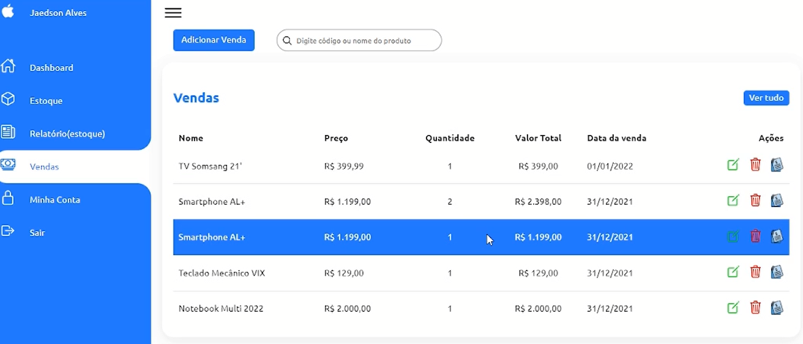

<h2>Sistema de Gerenciamento PHP - MYSQL</h2> 
<ul>
<li>Controle de Estoque - Adição, edição e Remoção de Produtos</li>
<li>Relátório de Estoque em Falta</li>
<li>Controle de Vendas</li>
</ul>

<h3>Orientações para uso do Sistema</h3> 
-->comando git clone https://github.com/jaedsonoliveira/dashboard-store ou download ZIP Code; 
-->passar arquivos para pasta raiz utilizando um Lamp de sua escolha; 
-->importar banco SQL em seu sistema de banco de dados, vc pode encontrar o arquivo estoque.sql no projeto; 
-->usuário padrão para acesso ao sistema (Número :987654, senha: 123).
